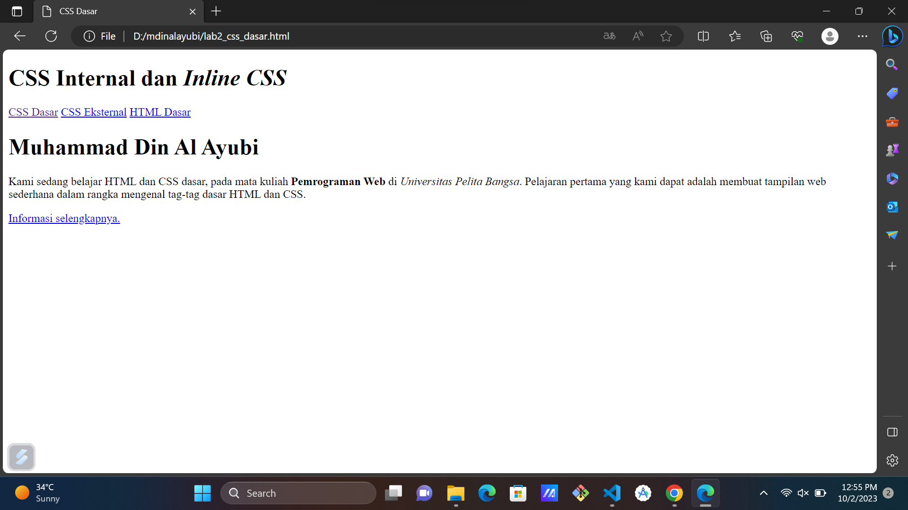
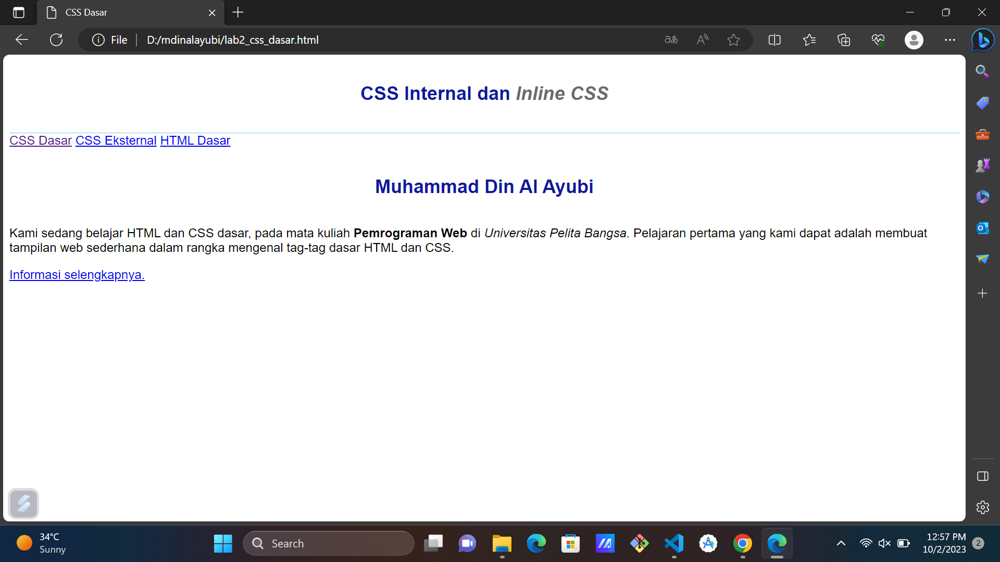
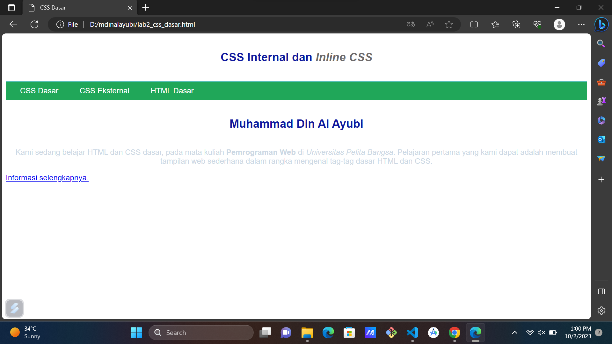
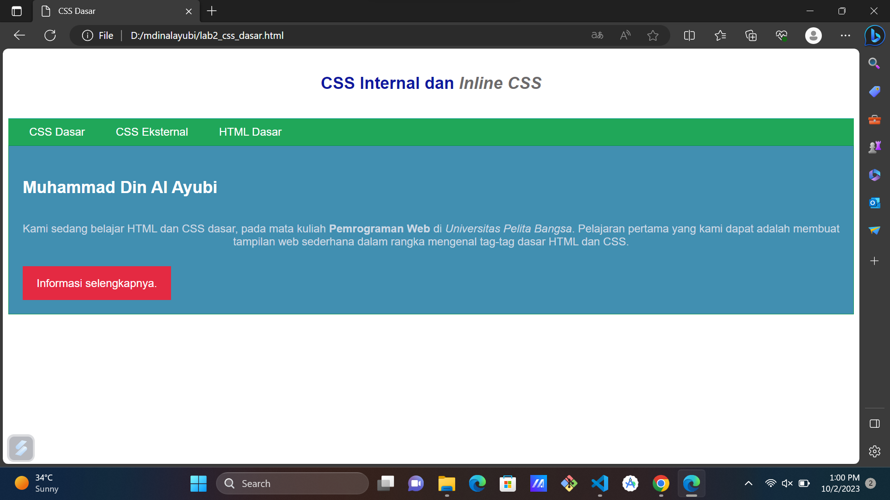
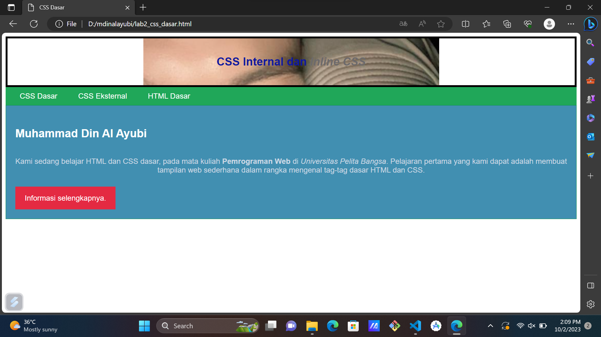

# lab2web
# Nama : Muhammad Din Al Ayubi
# NIM : 312210293
# Kelas : TI22A3

## Tugas Pemrograman Web 1
### Membuat dokumen HTML
* Buatlah dokumen HTML seperti berikut
```python
<!DOCTYPE html>
<html lang="en">
<head>
    <meta charset="UTF-8">
    <meta name="viewport" content="width=device-width, initial-scale=1.0">
    <title>CSS Dasar</title>
</head>
<body>
    <header>
        <h1>CSS Internal dan <i>Inline CSS</i></h1>
    </header>
    <nav>
        <a href="lab2_css_dasar.html">CSS Dasar</a>
        <a href="lab2_css_eksternal.html">CSS Eksternal</a>
        <a href="lab1_tag_dasar.html">HTML Dasar</a>
    </nav>
</head>
</html>
```
* Selanjutnya buka pada brwoser untuk melihat hasilnya.

### Mendeklarasikan CSS Internal
* Kemudian tambahkan deklarasi CSS internal seperti berikut pada bagian head dokumen.
```python
<head>
    <title>CSS Dasar</title>
    <style>
        body {
            font-family:'Open Sans', sans-serif;
        }
        header {
            min-height: 80px;
            border-bottom:1px solid #77CCEF;
        }
        h1 {
            font-size: 24px;
            color: #0F189F;
            text-align: center;
            padding: 20px 10px;
        }
        h1 i {
            color:#6d6a6b;
        }
    </style>
    <head>
```
* Selanjutnya simpan perubahan yang ada, dan lakukan refresh pada browser untuk melihat
hasilnya.

### Menambahkan Inline CSS
* Kemudian tambahkan deklarasi inline CSS pada tag <p> seperti berikut.
```python
<p style="text-align: center; color: #ccd8e4;">
```
* Simpan kembali dan refresh kembali browser untuk melihat perubahannya.

### Membuat CSS Eksternal
* Buatlah file baru dengan nama style_eksternal.css kemudian buatlah deklarasi CSS seperti berikut.
```python
nav{
    background: #20A759;
    color:#fff;
    padding: 10px;
}
nav a {
    color: #fff;
    text-decoration: none;
    padding:10px 20px;
}
nav .active,
nav a:hover {
    background: #0B6B3A;
}
```
* Kemudian tambahkan tag <link> untuk merujuk file css yang sudah dibuat pada bagian <head>
```python
 <head>
 <!-- menyisipkan css eksternal -->
 <link rel="stylesheet" href="style_eksternal.css" type="text/css">
</head>
```
* Selanjutnya refresh kembali browser untuk melihat perubahannya.

### Menambahkan CSS Selector
* Selanjutnya menambahkan CSS Selector menggunakan ID dan Class Selector. Pada file
style_eksternal.css, tambahkan kode berikut.
```python
/* ID Selector */
#intro {
    background: #418fb1;
    border: 1px solid #099249;
    min-height: 100px;
    padding: 10px;
}
#intro h1 {
    text-align: left;
    border: 0;
    color: #fff;
}
/* Class Selector */
.button {
    padding: 15px 20px;
    background: #bebcbd;
    color: #fff;
    display: inline-block;
    margin: 10px;
    text-decoration: none;
}
.btn-primary {
    background: #E42A42;
}
```
* Kemudian simpan kembali dan refresh browser untuk melihat perubahannya.

1. Lakukan eksperimen dengan mengubah dan menambah properti dan nilai pada kode CSS
dengan mengacu pada CSS Cheat Sheet yang diberikan pada file terpisah dari modul ini.
```python
header{
    background-image: url(d:/mdinalayubi/ayubi.jpg);
    background-position: center center;
    background-size: 630px;
    background-repeat: no-repeat;
    border: 4px solid #000;
}
```

2. Apa perbedaan pendeklarasian CSS elemen h1 {...} dengan #intro h1 {...}? berikan penjelasannya!
* Kalau h1 menggunakan internal dan inline pada penggunaan style nya sedangkan intro menggunakan eksternal css style nya
3. Apabila ada deklarasi CSS secara internal, lalu ditambahkan CSS eksternal dan inline CSS pada elemen yang sama. Deklarasi manakah yang akan ditampilkan pada browser? Berikan penjelasan dan contohnya!
* Semuanya akan tampil tergantung penyebutnya contohnya pada gambar no 1
4. Pada sebuah elemen HTML terdapat ID dan Class, apabila masing-masing selector tersebut terdapat deklarasi CSS, maka deklarasi manakah yang akan ditampilkan pada browser? Berikan penjelasan dan contohnya! ( p id="paragraf-1" class="text-paragraf" )
* Di praktek Hari ini keduanya tampil tapi berbeda